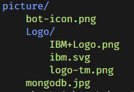

# goit-pycore-hw-04
*Repository for storing solutions to algorithmic homework assignments for GoIT Python Course, Homework 04.*
***

[🇺🇦 *Перейти до української версії*](#uk)
<span id="en"></span>

## Table of Contents

1. [***"Total and Average Salary"***](#task-1)
2. [***"File with Data about Cats"***](#task-2)
3. [***"Directory Structure Visualization"***](#task-3)
4. [***"Console-based Assistant Bot"***](#task-4)

---

### Task 1

**Develop the function `total_salary(path)` to analyze a file with developers' salaries.**

#### Input data:
- A text file where each line contains a developer's last name and their salary, separated by a comma, without spaces. For example:
```python
Alex Korp,3000
Nikita Borisenko,2000
Sitarama Raju,1000
```

#### Requirements:
1. The function should take the file path as an argument `path`.
2. Pay attention to the file's encoding when opening it.
3. Calculate the total and average sums of the salaries.
4. Return a tuple of two numbers: the total sum and the average salary.

#### Recommendations:
- Use the context manager `with` for safe file reading.
- Apply the `split(',')` method to separate information in each line.
- Handle potential errors when opening or reading the file.

#### Evaluation Criteria:
- The function must accurately determine the total and average sums.
- There should be error handling for cases when the file is missing or corrupted.
- The code must be clean, structured, and comprehensible.

#### Example of usage:
```python
total, average = total_salary("path/to/salary_file.txt")
print(f"Total salary sum: {total}, Average salary: {average}")
```

#### Expected result:
```plaintext
Total salary sum: 6000, Average salary: 2000
```

[🇺🇦 *Прочитати це солов'їною*](#завдання-1) | [*Return to Table of Contents* 🔙](#en)

---

### Task 2

**Develop the function `get_cats_info(path)` to read a file with data about cats.**

#### Input data:
- A text file where each line contains a unique cat identifier, its name, and age, separated by a comma. For example:
```python
60b90c1c13067a15887e1ae1,Tayson,3
60b90c2413067a15887e1ae2,Vika,1
60b90c2e13067a15887e1ae3,Barsik,2
60b90c3b13067a15887e1ae4,Simon,12
60b90c4613067a15887e1ae5,Tessi,5
```

#### Requirements:
1. The function should take the file path as an argument `path`.
2. The file contains data about cats with an identifier, name, and age.
3. The function should return a list of dictionaries, each containing information about one cat.

#### Recommendations:
- Use the context manager `with` for safe file reading.
- Consider the file encoding when opening it.
- Apply the `split(',')` method to separate information in each line.
- Create a dictionary with keys "id", "name", "age" for each record and add it to the return list.
- Handle errors related to file access or reading.

#### Evaluation Criteria:
- The function must accurately process data and return the correct list of dictionaries.
- Proper exception and error handling must be implemented.
- The code should be clean, structured, and comprehensible.

#### Example of usage:
```python
cats_info = get_cats_info("path/to/cats_file.txt")
print(cats_info)
```

#### Expected result:
```json
[
    {"id": "60b90c1c13067a15887e1ae1", "name": "Tayson", "age": "3"},
    {"id": "60b90c2413067a15887e1ae2", "name": "Vika", "age": "1"},
    {"id": "60b90c2e13067a15887e1ae3", "name": "Barsik", "age": "2"},
    {"id": "60b90c3b13067a15887e1ae4", "name": "Simon", "age": "12"},
    {"id": "60b90c4613067a15887e1ae5", "name": "Tessi", "age": "5"}
]
```

[🇺🇦 *Прочитати це солов'їною*](#завдання-2) | [*Return to Table of Contents* 🔙](#en)

---

### Task 3

**Develop a script to visualize the structure of a directory using colored representation of subdirectories and files.**

#### Input Data:
- The path to the directory is passed as a command-line argument. The script analyzes and visualizes the structure of this directory.

#### Requirements:
1. Create a virtual environment to isolate project dependencies.
2. Use the `colorama` library for colored output of directory and file names.
3. The script should accept the path to the directory as an argument at startup.
4. Implement a recursive method to traverse directories to display their structure.
5. Include error checking and handling, for example, when the path does not exist or is not a directory.

#### Execution Recommendations:
- Install `colorama` in the virtual environment using `pip`.
- Use the `sys` module to get the directory path as a command-line argument.
- Use the `pathlib` module to work with the file system.
- Ensure proper formatting of the output using `colorama` functions.

#### Evaluation Criteria:
- Creation and use of a virtual environment.
- Correct acquisition and handling of the directory path.
- Accuracy of directory structure output.
- Correct application of colored output.
- Code quality, including readability, structuring, and commenting.

#### Example of Use:
```bash
python hw03.py /path/to/your/directory
```

This script will display in the terminal a list of all subdirectories and files in the specified directory, using different colors for subdirectories and files to enhance visual perception.

For a directory with the following structure
```
📦picture
 ┣ 📂Logo
 ┃ ┣ 📜IBM+Logo.png
 ┃ ┣ 📜ibm.svg
 ┃ ┗ 📜logo-tm.png
 ┣ 📜bot-icon.png
 ┗ 📜mongodb.jpg
```
the script should display a similar structure:



[🇺🇦 *Прочитати це солов'їною*](#завдання-3) | [*Return to Table of Contents* 🔙](#en)

---

### Task 4

**Develop a console-based assistant bot that recognizes and responds to user commands.**

#### Input Data:
- The bot should operate as a CLI (Command Line Interface) application and handle commands entered via the keyboard.

#### Requirements:
1. The program must include a `main()` function that manages the main loop for processing commands.
2. Implement a `parse_input()` function that will analyze the entered string for a command and its arguments. Commands and arguments should be recognized regardless of the input case.
3. The program should wait for user input and process the commands using corresponding functions. Upon entering commands "exit" or "close", the program terminates.
4. Implement handler functions for various commands such as `add_contact()`, `change_contact()`, `show_phone()`.
5. Use a dictionary to store names and phone numbers, where the name will be the key and the phone number the value.
6. The program should identify and report incorrectly entered commands.

#### Command Descriptions:
- **hello**: Outputs "How can I help you?"
- **add [name] [phone number]**: Adds a contact. Outputs "Contact added."
- **change [name] [new phone number]**: Updates an existing contact. Outputs "Contact updated." or an error message if the name is not found.
- **phone [name]**: Outputs the phone number for the specified name. Shows the phone number or an error message.
- **all**: Outputs all stored contacts with their numbers.
- **close** or **exit**: Ends the program with the output "Good bye!".
- If a command does not match any of the formats, outputs "Invalid command."

#### Recommendations for Implementation:
- Systematize the description of command formats for the assistant bot to understand which functions need to be implemented.
- Ensure proper testing of all commands before deploying in a production environment.

#### Execution Example:
```bash
python assistant_bot.py
```
```plaintext
Welcome to the assistant bot!
Enter a command: hello
How can I help you?
Enter a command: add John 1234567890
Contact added.
Enter a command: phone John
1234567890
Enter a command: exit
Good bye!
```

[🇺🇦 *Прочитати це солов'їною*](#завдання-4) | [*Return to Table of Contents* 🔙](#en)


___
***
---


[🇬🇧 *Go to the English version*](#en)
<span id="uk"></span>

## Зміст
1. [***"Загальна та середня зарплата"***](#завдання-1)
2. [***"Файл з даними про котів"***](#завдання-2)
3. [***"Візуалізації структури директорії"***](#завдання-3)
4. [***"Консольний бот-помічник"***](#завдання-4)
---

### Завдання 1

**Розробити функцію `total_salary(path)` для аналізу файлу з заробітними платами розробників.**

#### Вхідні дані:
- Текстовий файл, де кожен рядок містить прізвище розробника та його заробітну плату, розділені комою, без пробілів. До прикладу:
```python
Alex Korp,3000
Nikita Borisenko,2000
Sitarama Raju,1000
```

#### Вимоги:
1. Функція має приймати шлях до файлу як аргумент `path`.
2. При відкритті файлу приділити увагу кодуванню.
3. Обчислити загальну та середню суму заробітних плат.
4. Повернути кортеж із двох чисел: загальної суми та середньої заробітної плати.

#### Рекомендації:
- Використовувати менеджер контексту `with` для безпечного читання файлів.
- Застосувати метод `split(',')` для розділення інформації в кожному рядку.
- Обробляти можливі помилки при відкритті або читанні файлу.

#### Критерії оцінювання:
- Функція має точно визначати загальну та середню суми.
- Повинна бути обробка випадків, коли файл відсутній або пошкоджений.
- Код має бути чистим, структурованим і зрозумілим.

#### Приклад використання:
```python
total, average = total_salary("path/to/salary_file.txt")
print(f"Загальна сума заробітної плати: {total}, Середня заробітна плата: {average}")
```

#### Очікуваний результат:
```plaintext
Загальна сума заробітної плати: 6000, Середня заробітна плата: 2000
```

### Особливості даної реалізації:

- **Розширена перевірка доступності файлу:** Програма не лише інспектує наявність вхідного файлу, але й перевіряє можливість доступу до нього, включаючи обробку системних помилок, що стосуються доступу до файлу.
- **Підтримка нестандартних вхідних даних:** Функція адаптована для обробки файлів, що містять пусті рядки або рядки, заповнені лише пробільними символами.
- **Єдиний шаблон повідомлення про помилки:** Використання шаблону `format_error_msg` для уніфікації та полегшення корегування повідомлень про помилки, що допомагає забезпечувати однаковість повідомлень та їх легке повторне використання.
- **Ігнорування невідповідних рядків:** Функція вміє пропускати рядки, які не відповідають очікуваному формату, дозволяючи користувачам залишати коментарі або службову інформацію у файлі. Про такі рядки користувачу надсилається повідомлення з вказівкою номеру рядка та його вмісту.
- **Толерантність до форматів чисел:** Програма може приймати заробітну плату у форматі `float`, навіть якщо вона вказана з комою замість крапки, тим самим толеруючи дрібні помилки введення.
- **Форматування результату:** Результат підрахунку повертається у форматі `float` з округленням до двох знаків після коми, забезпечуючи точність та зручність відображення результатів (до прикладу: "1000.00", "123.40").
- **Обробка багаторозрядних чисел:** Функція ефективно обробляє багаторозрядні числа з використанням пробілу для відділення розрядів, що є звичним для України. Водночас, не призначена для обробки даних, де для відділення тисяч використовується крапка (до прикладу: "6.000"). Крапка або кома розглядається як знак, що відділяє цілу частину від дробової (до прикладу: "1200.50").

[🇬🇧 *Read this in English*](#task-1) | [*Повернутися до змісту* 🔙](#uk)

---

### Завдання 2

**Розробити функцію `get_cats_info(path)` для читання файлу з даними про котів.**

#### Вхідні дані:
- Текстовий файл, де кожен рядок містить унікальний ідентифікатор кота, його ім'я та вік, розділені комою. До прикладу:
```python
60b90c1c13067a15887e1ae1,Tayson,3
60b90c2413067a15887e1ae2,Vika,1
60b90c2e13067a15887e1ae3,Barsik,2
60b90c3b13067a15887e1ae4,Simon,12
60b90c4613067a15887e1ae5,Tessi,5
```

#### Вимоги:
1. Функція має приймати шлях до файлу як аргумент `path`.
2. Файл містить дані про котів з ідентифікатором, ім'ям і віком.
3. Функція має повертати список словників, кожен з яких містить інформацію про одного кота.

#### Рекомендації:
- Використовувати менеджер контексту `with` для безпечного читання файлу.
- Враховувати кодування файлу при його відкритті.
- Застосувати метод `split(',')` для розділення інформації в кожному рядку.
- Створити словник з ключами "id", "name", "age" для кожного запису та додати його до списку, що буде повернуто.
- Обробляти помилки, пов'язані з доступом до файлу або його читанням.

#### Критерії оцінювання:
- Функція має точно обробляти дані і повертати коректний список словників.
- Має бути виконана належна обробка винятків та помилок.
- Код має бути чистим, структурованим і зрозумілим.

#### Приклад використання:
```python
cats_info = get_cats_info("path/to/cats_file.txt")
print(cats_info)
```

#### Очікуваний результат:
```json
[
    {"id": "60b90c1c13067a15887e1ae1", "name": "Tayson", "age": "3"},
    {"id": "60b90c2413067a15887e1ae2", "name": "Vika", "age": "1"},
    {"id": "60b90c2e13067a15887e1ae3", "name": "Barsik", "age": "2"},
    {"id": "60b90c3b13067a15887e1ae4", "name": "Simon", "age": "12"},
    {"id": "60b90c4613067a15887e1ae5", "name": "Tessi", "age": "5"}
]
```

Ось оформлений звіт про особливості реалізації вашого завдання, представлений у форматі Markdown для кращої структуризації і читабельності:

---

### Особливості даної реалізації:
- **Перевірка кількості елементів у рядку:** Система перевіряє кожен рядок файлу на відповідність очікуваній кількості елементів. Якщо кількість елементів не збігається, користувачу виводиться відповідне повідомлення, але скрипт продовжує обробку наступних рядків.
- **Перевірка віку кота:** Реалізована спеціальна перевірка, що вік кота є цілим додатнім числом. Використання методу `.isdigit()` дозволяє ефективно перевірити це поле, і у разі помилки користувач отримує відповідну інформацію, але програма продовжує роботу.
- **Виведення інформації у форматі JSON:** Завдяки використанню модуля `json`, вивід інформації у термінал відбувається у структурованому json-форматі. Це робить дані більш організованими та легкими для аналізу та подальшої обробки.
- **Ігнорування пустих рядків:** Вхідний файл перевіряється на наявність пустих рядків, які автоматично ігноруються, що дозволяє забезпечити чистоту даних для обробки.
- **Розширена перевірка доступності файлу:** Програма не лише інспектує наявність вхідного файлу, але й перевіряє можливість доступу до нього, включаючи обробку системних помилок, що стосуються доступу до файлу.

[🇬🇧 *Read this in English*](#task-2) | [*Повернутися до змісту* 🔙](#uk)

---

### Завдання 3

**Розробити скрипт для візуалізації структури директорії, використовуючи кольорове відображення імен піддиректорій та файлів.**

#### Вхідні дані:
- Шлях до директорії передається як аргумент командного рядка. Скрипт аналізує та візуалізує структуру цієї директорії.

#### Вимоги:
1. Створити віртуальне оточення для ізоляції залежностей проекту.
2. Використати бібліотеку `colorama` для кольорового виведення імен директорій та файлів.
3. Скрипт має приймати шлях до директорії як аргумент при запуску.
4. Реалізувати рекурсивний спосіб обходу директорій для відображення їх структури.
5. Врахувати перевірку та обробку помилок, до прикладу, коли шлях не існує або не є директорією.

#### Рекомендації для виконання:
- Встановити `colorama` у віртуальному оточенні за допомогою `pip`.
- Використовувати модуль `sys` для отримання шляху до директорії як аргументу командного рядка.
- Для роботи з файловою системою використати модуль `pathlib`.
- Забезпечити належне форматування виводу, застосовуючи функції `colorama`.

#### Критерії оцінювання:
- Створення та використання віртуального оточення.
- Правильність отримання та обробки шляху до директорії.
- Точність виведення структури директорії.
- Коректне застосування кольорового виведення.
- Якість коду, включно з читабельністю, структуруванням та коментуванням.

#### Приклад використання:
```bash
python hw03.py /шлях/до/вашої/директорії
```

Цей скрипт виведе у терміналі список всіх піддиректорій та файлів у вказаній директорії, використовуючи різні кольори для піддиректорій та файлів, що сприяє кращому візуальному сприйняттю.

Для директорії зі наступною структурою
```
📦picture
 ┣ 📂Logo
 ┃ ┣ 📜IBM+Logo.png
 ┃ ┣ 📜ibm.svg
 ┃ ┗ 📜logo-tm.png
 ┣ 📜bot-icon.png
 ┗ 📜mongodb.jpg
```
скрипт повинен вивести схожу структуру:


[🇬🇧 *Read this in English*](#task-3) | [*Повернутися до змісту* 🔙](#uk)

---
### Завдання 4

**Розробити консольного бота-помічника, який розпізнаватиме та відповідатиме на команди користувача.**

#### Вхідні дані:
- Бот має працювати як консольний застосунок CLI (Command Line Interface) та обробляти команди, введені через клавіатуру.

#### Вимоги:
1. Програма повинна включати функцію `main()`, яка управляє основним циклом обробки команд.
2. Реалізувати функцію `parse_input()`, що аналізуватиме введений рядок на команду та її аргументи. Команди та аргументи мають бути розпізнані незалежно від регістру введення.
3. Програма має очікувати на введення команд користувачем та обробляти їх за допомогою відповідних функцій. При введенні команд "exit" або "close", програма завершує роботу.
4. Реалізувати функції обробники для різних команд, такі як `add_contact()`, `change_contact()`, `show_phone()`.
5. Використовувати словник для зберігання імен та номерів телефонів. Ім'я буде ключем, номер телефону – значенням.
6. Програма повинна ідентифікувати та повідомляти про неправильно введені команди.

#### Опис команд:
- **hello**: Виводить "How can I help you?"
- **add [ім'я] [номер телефону]**: Додає контакт. Виводить "Contact added."
- **change [ім'я] [новий номер телефону]**: Оновлює наявний контакт. Виводить "Contact updated." або повідомлення про помилку, якщо ім'я не знайдено.
- **phone [ім'я]**: Показує номер телефону для зазначеного імені. Виводить номер телефону або повідомлення про помилку.
- **all**: Виводить усі збережені контакти з номерами.
- **close** або **exit**: Завершує роботу програми з виведенням "Good bye!".
- Якщо команда не відповідає жодному з форматів, виводить "Invalid command."

#### Рекомендації для виконання:
- Систематизувати опис форматів команд для бота-помічника, щоб зрозуміти, які функції потрібно реалізувати.
- Забезпечити належне тестування всіх команд перед впровадженням у продуктивне середовище.

#### Приклад виконання:
```bash
python assistant_bot.py
```
```plaintext
Welcome to the assistant bot!
Enter a command: hello
How can I help you?
Enter a command: add John 1234567890
Contact added.
Enter a command: phone John
1234567890
Enter a command: exit
Good bye!
```

[🇬🇧 *Read this in English*](#task-4) | [*Повернутися до змісту* 🔙](#uk)
